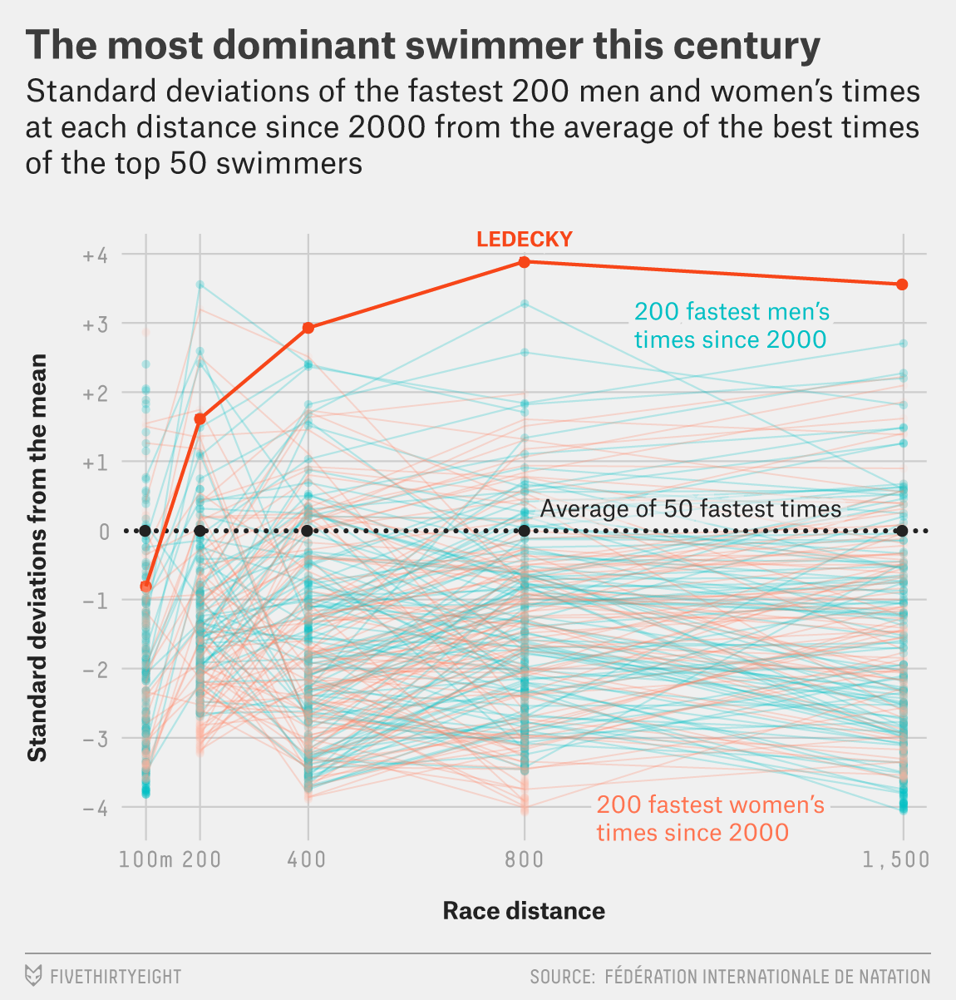
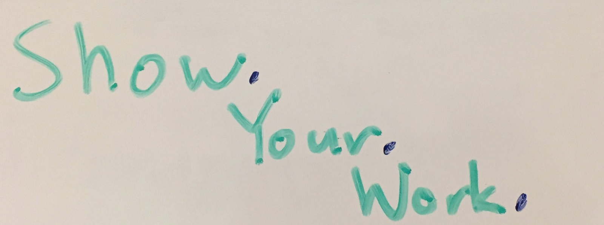
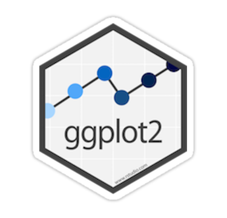
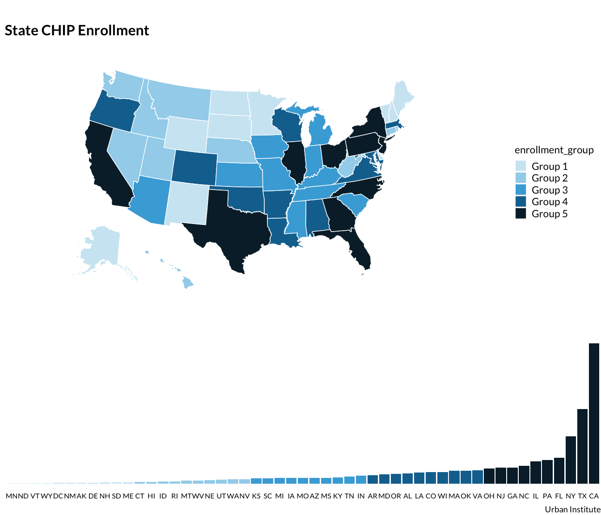

---
output:
  revealjs::revealjs_presentation:
    css: www/styles.css
    incremental: TRUE
    reveal_options:
      slideNumber: TRUE
      previewLinks: TRUE
editor_options:
  chunk_output_type: console
---

```{r, echo = FALSE, message = FALSE, warning = FALSE}
library(knitr)

opts_chunk$set(echo = FALSE)
opts_chunk$set(message = FALSE)
opts_chunk$set(warning = FALSE)
opts_chunk$set(fig.width = 8)
opts_chunk$set(fig.height = 4.5)

library(tidyverse)
library(urbnthemes)
library(urbnmapr)
```

# Welcome

## Best Practices and Strategies to Create Effective Visualizations

#### Aaron Williams
#### @awunderground


## ~~Best Practices and Strategies to Create Effective Visualizations~~

### Why I Love R

#### Aaron Williams
#### @awunderground


# WHY: Principles for selecting a data viz tool

## 1. Looks good!



*Source: [fivethirtyeight](https://fivethirtyeight.com/features/the-52-best-and-weirdest-charts-we-made-in-2016/)*

## 2. Flexible

## 3. Reproducible



## 4. Scalable

AKA "Please just don't make me point-and-click 100 charts"


## 5. In my analysis workflow


# WHAT: R and ggplot2

## 


*Source: [Hadley Wickham](https://en.wikipedia.org/wiki/R_(programming_language)#/media/File:R_logo.svg)*

## 



*Source: ggplot2*

## fivethirtyeight

<iframe class="stretch" data-src="https://fivethirtyeight.com/features/the-52-best-and-weirdest-charts-we-made-in-2016/"></iframe>

## Financial Times

<blockquote class="twitter-tweet" data-lang="en"><p lang="en" dir="ltr">In the first edition of <a href="https://twitter.com/FT?ref_src=twsrc%5Etfw">@FT</a>&#39;s World Cup Extra series of stats-y briefings, <a href="https://twitter.com/muradahmed?ref_src=twsrc%5Etfw">@muradahmed</a> and I ask: as curtain-raisers go, just how underwhelming is Russia vs Saudi Arabia?<a href="https://t.co/0aQXcaD9YV">https://t.co/0aQXcaD9YV</a> <a href="https://t.co/GOXVyVlRW7">pic.twitter.com/GOXVyVlRW7</a></p>&mdash; John Burn-Murdoch (@jburnmurdoch) <a href="https://twitter.com/jburnmurdoch/status/1006779901519843328?ref_src=twsrc%5Etfw">June 13, 2018</a></blockquote>
<script async src="https://platform.twitter.com/widgets.js" charset="utf-8"></script>

## BBC

<iframe class="stretch" data-src="https://www.bbc.com/news/health-43726436"></iframe>

# HOW: Grammar of Graphics

## Leland Wilkinson

[Grammar of Graphics](https://www.amazon.com/Grammar-Graphics-Statistics-Computing/dp/0387245448)

## Hadley Wickham

[A Layered Grammar of Graphics](http://vita.had.co.nz/papers/layered-grammar.pdf)


*Source: [Hadley Wickham](https://en.wikipedia.org/wiki/Hadley_Wickham#/media/File:Hadley-wickham2016-02-04.jpg)*

## 1. Data

```{r 1-data}
storms %>%
  select(name, year, category, lat, long, wind, pressure) %>%
  sample_n(10) %>%
  kable()
```

`ggplot(data = )`

## 2. Aesthetic mappings

`aes(x = , y = , color = )`

X or Y

```{r fig.height = 1.5}
recent_storms <- filter(storms, year > 2005) %>%
  sample_n(50)

recent_storms %>%
  ggplot(aes(pressure, 1)) +
  geom_point() +
  scale_y_continuous(breaks = 0) +
  labs(y = NULL) +
  theme_bw() +
  theme(panel.border = ggplot2::element_blank())
```

Color or Fill

```{r fig.height = 1.5}
recent_storms %>%
  ggplot(aes(pressure, 1, color = wind)) +
  geom_point(alpha = 0.5) +
  scale_y_continuous(breaks = 0) +
  labs(y = NULL) +
  theme_bw() +
  theme(panel.border = ggplot2::element_blank())
```

## Aesthetic mappings

Size

```{r fig.height = 1.5}
recent_storms %>%
  ggplot(aes(pressure, 1, size = wind)) +
  geom_point(alpha = 0.5) +
  scale_y_continuous(breaks = 0) +
  labs(y = NULL) +
  theme_bw() +
  theme(panel.border = ggplot2::element_blank())
```

Shape

```{r fig.height = 1.5}
recent_storms %>%
  ggplot(aes(pressure, 1, shape = status)) +
  geom_point(alpha = 0.5) +
  scale_y_continuous(breaks = 0) +
  labs(y = NULL) +
  theme_bw() +
  theme(panel.border = ggplot2::element_blank())
```

Others: transparency, animations, faceting

## 3. Geometric objects

Plots are often referred to by the name of their geometric object(s). 

Bar

```{r}
recent_storms %>%
  ggplot(aes(category)) +
  geom_bar() +
  labs(title = "Most storms are tropical storms",
       subtitle = "Storms since 2006")
```

`geom_bar()`

## 3. Geometric objects

Line

```{r}
storms %>%
  count(name, year) %>%
  count(year) %>%
  ggplot(aes(year, nn)) +
  geom_line() +
  scale_x_continuous(limits = c(1970, 2020)) +
  scale_y_continuous(limits = c(0, NA)) +
  labs(title = "Number of storms per year",
       x = "Year",
       y = "Count")
```

`geom_line()`

## 3. Geometric objects

Point

```{r}
recent_storms <- filter(storms, year > 2005)

recent_storms50 <- filter(storms, year > 2005) %>%
  sample_n(50)

recent_storms %>%
  ggplot(aes(pressure, wind)) +
  geom_point() +
  scale_y_continuous(limits = c(0, 160)) +
  labs(title = "Low pressure storms have higher wind speeds",
       subtitle = "Storms since 2006")
```

`geom_point()`

## 3. Geometric objects

?

```{r}
storms %>%
  filter(name == "Katrina" & year == 2005) %>%
  ggplot(aes(long, lat, group = name)) +
  geom_path() +
  theme_urbn_map()
```

## 3. Geometric objects

Path of Hurricane Katrina

```{r}
storms %>%
  filter(name == "Katrina" & year == 2005) %>%
  ggplot(aes(long, lat, group = name)) +
  geom_polygon(data = states, aes(long, lat, group = group),
               fill = "grey", color = "#ffffff", size = 0.05) +
  geom_path() +
  coord_map(projection = "albers", lat0 = 39, lat1 = 45) +
  theme_urbn_map()
```

## 4. Scales

Before

`scale_x_continuous()`

```{r fig.height = 1}
recent_storms %>%
  ggplot(aes(pressure, 1)) +
  geom_point() +
  scale_y_continuous(breaks = 0) +
  labs(y = NULL) +
  theme_bw() +
  theme(panel.border = ggplot2::element_blank())
```

After

`scale_x_log10()`

```{r fig.height = 1}
recent_storms50 %>%
  ggplot(aes(pressure, 1)) +
  geom_point() +
  scale_x_log10() +
  scale_y_continuous(breaks = 0) +
  labs(y = NULL) +
  theme_bw() +
  theme(panel.border = ggplot2::element_blank())
```

## 4. Scales

Before

`scale_size_continuous(breaks = c(25, 75, 125))`

```{r fig.height = 2}
recent_storms50 %>%
  ggplot(aes(pressure, 1, size = wind)) +
  geom_point(alpha = 0.5) +
  scale_size_continuous(breaks = c(25, 75, 125)) +  
  scale_y_continuous(breaks = 0) +
  labs(y = NULL) +
  theme_bw() +
  theme(panel.border = ggplot2::element_blank(),
        legend.direction = "horizontal")
```

After

`scale_size_continuous(range = c(0.5, 20), breaks = c(25, 75, 125))`

```{r fig.height = 2}
recent_storms50 %>%
  ggplot(aes(pressure, 1, size = wind)) +
  geom_point(alpha = 0.5) +
  scale_size_continuous(range = c(0.5, 20),
                        breaks = c(25, 75, 125)) +
  scale_y_continuous(breaks = 0) +
  labs(y = NULL) +
  theme_bw() +
  theme(panel.border = ggplot2::element_blank(),
        legend.direction = "horizontal")
```

## 5. Coordinate systems

### Cartesian

```{r}
ggplot(storms, aes(pressure, wind)) +
  geom_point(alpha = 0)
```

## 5. Coordinate systems

### Polar

`coord_polar()`

```{r}
tibble(x = 1:100, 
       y = 1:100) %>%
  ggplot(aes(x, y)) +
  geom_point(alpha = 0) +
  coord_polar()
```

## 6. Facets (optional)

Facet wrap

`facet_wrap(~category)`

```{r}
recent_storms %>%
  ggplot(aes(long, lat, group = name)) +
  geom_polygon(data = states, aes(long, lat, group = group),
               fill = "grey", color = "#ffffff", size = 0.05) +
  geom_path() +
  facet_wrap(~category) +
  coord_map(projection = "albers", lat0 = 39, lat1 = 45) +
  theme_urbn_map()
```

## 6. Facets (optional)

Facet grid

`facet_grid(month~status)`

```{r}
storms %>%
  filter(month %in% c(6, 7, 8)) %>%
  ggplot(aes(pressure, wind)) +
  geom_point() +
  facet_grid(month~status)
```

## 7. Statistical transformations (optional)

Count

## 8. Themes

Default theme

```{r}
recent_storms50 %>%
  ggplot(aes(pressure, wind)) +
  geom_point() +
  scale_y_continuous(limits = c(0, 160)) +
  labs(title = "Low pressure storms have higher wind speeds")
```

## 8. Themes

fivethirtyeight theme

```{r}
library(ggthemes)

recent_storms50 %>%
  ggplot(aes(pressure, wind)) +
  geom_point() +
  scale_y_continuous(limits = c(0, 160)) +  
  labs(title = "Low pressure storms have higher wind speeds") +
  theme_fivethirtyeight(base_size = 12, base_family = "sans")
```

## 8. Themes

urbnthemes

```{r}
recent_storms50 %>%
  ggplot(aes(pressure, wind)) +
  geom_point(color = "#1696d2") +
  scale_y_continuous(limits = c(0, 160), expand = c(0, 0)) +  
  labs(title = "Low pressure storms have higher wind speeds") +
  theme_urbn_print()
```

## Coding example


## New? 9. Arrangements



## New? 9. Arrangements

Animation

## New? Interactivity

# Examples

## urbnmapr

```{r}
statedata %>% 
  left_join(states, by = "state_name") %>% 
  ggplot(mapping = aes(long, lat, group = group, fill = horate)) +
  geom_polygon(color = "#ffffff", size = .25) +
  coord_map(projection = "albers", lat0 = 39, lat1 = 45) +
  scale_fill_gradientn(labels = scales::percent) +
  labs(fill = "Homeownership rate") +
  theme_urbn_map()
```

## Pension code

*In directory*

## R Shiny

<iframe class="stretch" data-src=https://www.urban.org/policy-centers/cross-center-initiatives/program-retirement-policy/projects/dynasim-visualizing-older-americans-future-well-being/fiscal-health-social-security"></iframe>

## Graphics guide

<iframe class="stretch" data-src="https://ui-research.github.io/r-at-urban/graphics-guide.html"></iframe>

# Strengths and Weaknesses

## 1. Looks good!

A

## 2. Flexible

B

*Once you understand ggplot2, it is really useful for doing 90% of the results with 10% of the effort* 

(Jennfer Hill) 

## 3. Reproducible

A+

## 4. Scalable

B+

## 5. In my analysis workflow

A+

# Questions
